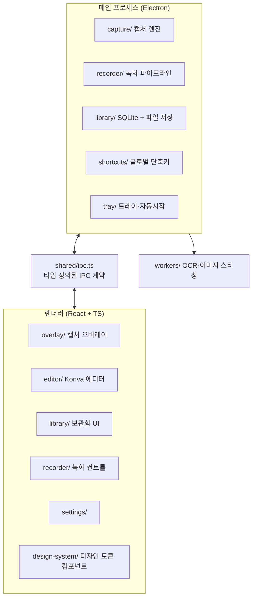

# 📸 Snaply

깔끔하고 미니멀한 디자인의 무료 오픈소스 화면 캡처 앱. 캡처부터 편집·정리·공유까지 한 번에 되는 크로스플랫폼(Windows/macOS) 데스크톱 앱이에요.

> 스크린샷: _(준비 중 — v1.0에서 추가돼요)_

## 주요 기능

- **캡처**: 영역 / 창 / 전체 화면 / 스크롤(파노라마) / All-in-One, 고정 크기 캡처(프리셋), 저장된 영역 반복 캡처(★, 트레이 원클릭), [지연 캡처(타이머)](docs/timed-capture.md), 글로벌 단축키
- **에디터**: 객체 기반 주석(화살표·도형·텍스트·말풍선·스텝 넘버), 블러/모자이크/스마트 리댁션, 스포트라이트, 이미지 효과, 템플릿, 무제한 undo
- **녹화**: 영역/전체 화면 → MP4/GIF, 웹캠 오버레이, 트리밍
- **OCR**: Grab Text (한국어+영어), 이미지 내 텍스트 전문검색
- **보관함**: 자동 저장 + 자동 태깅, 검색, 그리드/타임라인 뷰
- **공유**: PNG/JPG/WebP/PDF/TIFF/PPTX 내보내기, 클립보드, 드래그&드롭

## 아키텍처



- 모든 메인↔렌더러 통신은 [src/shared/ipc.ts](src/shared/ipc.ts)에 타입 정의된 채널만 사용해요.
- 데이터베이스는 Electron 내장 Node의 `node:sqlite`(FTS5 포함)를 사용해요 — 네이티브 빌드가 필요 없어요.

## 개발하기

```bash
npm install
npm run dev        # 개발 모드 실행
npm run typecheck  # 타입 검사
npm run test       # 유닛 테스트 (Vitest)
npm run build      # 프로덕션 번들
npm run dist       # 배포 빌드 (electron-builder)
```

## 기술 스택

Electron · React 19 · TypeScript strict · Zustand · Konva.js · node:sqlite · tesseract.js · ffmpeg-static · electron-vite · Vitest · Playwright

## 알려진 제약 / 크로스플랫폼 TODO

Windows에서 개발·검증했고, macOS 쪽은 아래 항목의 실기기 검증이 필요해요 (`TODO(platform-verify)` 주석으로 표시).

| 영역 | 항목 |
|---|---|
| 스크롤 캡처 | macOS 휠 주입은 osascript 스텁 — CGEventCreateScrollWheelEvent 네이티브 헬퍼 필요 ([scrolling.ts](src/main/capture/scrolling.ts)) |
| 창 캡처 | macOS는 창 제목에 앱 이름이 없어 앱 이름 추정 검증 필요 ([capture/index.ts](src/main/capture/index.ts)) |
| 창 캡처 | 네이티브 창 경계 실시간 hover 감지는 미구현 — 창 목록 그리드로 대체 ([WindowPicker.tsx](src/renderer/src/overlay/WindowPicker.tsx)) |
| 녹화 | 시스템 오디오 loopback은 Windows 전용, macOS는 오디오 없이 폴백 ([engine.ts](src/renderer/src/recorder/engine.ts)) |
| 자동 시작 | macOS 13+ Login Items 노출 확인 필요 ([autostart.ts](src/main/autostart.ts)) |
| 권한 | macOS 화면 기록 권한 상태 조회 연동 ([settings/App.tsx](src/renderer/src/settings/App.tsx)) |
| OCR | 첫 실행 시 kor+eng traineddata(수 MB) CDN 다운로드 — 오프라인 번들 검토 ([ocr.ts](src/main/library/ocr.ts)) |
| i18n | 전 화면 한/영 지원(실시간 전환) — 한국어 원문 키 사전 방식 ([i18n.ts](src/renderer/src/common/i18n.ts)), 스탬프 이름 등 일부 데이터 라벨은 한국어 유지 |
| 기타 | 비디오 썸네일(ffmpeg 첫 프레임), 자동 OCR 끄기 옵션, 녹화 창 크기 전용 IPC 채널 |

## 라이선스

MIT. 모든 아이콘·그래픽 에셋은 자체 제작했어요. 폰트는 [Pretendard](https://github.com/orioncactus/pretendard)(SIL OFL)를 사용해요.
