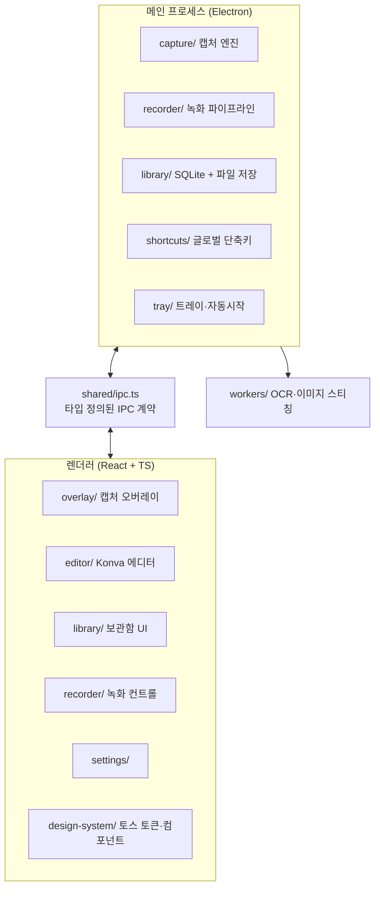

# 📸 Snaply

토스 스타일의 무료 오픈소스 화면 캡처 앱. Snagit의 기능 컨셉을 벤치마킹한 크로스플랫폼(Windows/macOS) 데스크톱 앱이에요.

> 스크린샷: _(준비 중 — v1.0에서 추가돼요)_

## 주요 기능

- **캡처**: 영역 / 창 / 전체 화면 / 스크롤(파노라마) / All-in-One, 지연·예약 캡처, 글로벌 단축키
- **에디터**: 객체 기반 주석(화살표·도형·텍스트·말풍선·스텝 넘버), 블러/모자이크/스마트 리댁션, 스포트라이트, 이미지 효과, 템플릿, 무제한 undo
- **녹화**: 영역/전체 화면 → MP4/GIF, 웹캠 오버레이, 트리밍
- **OCR**: Grab Text (한국어+영어), 이미지 내 텍스트 전문검색
- **보관함**: 자동 저장 + 자동 태깅, 검색, 그리드/타임라인 뷰
- **공유**: PNG/JPG/WebP/PDF/TIFF/PPTX 내보내기, 클립보드, 드래그&드롭

## 아키텍처



- 모든 메인↔렌더러 통신은 [src/shared/ipc.ts](src/shared/ipc.ts)에 타입 정의된 채널만 사용해요.
- 데이터베이스는 Electron 내장 Node의 `node:sqlite`(FTS5 포함)를 사용해요 — 네이티브 빌드가 필요 없어요.

## 개발하기

```bash
npm install
npm run dev        # 개발 모드 실행
npm run typecheck  # 타입 검사
npm run test       # 유닛 테스트 (Vitest)
npm run build      # 프로덕션 번들
npm run dist       # 배포 빌드 (electron-builder)
```

## 기술 스택

Electron · React 19 · TypeScript strict · Zustand · Konva.js · node:sqlite · tesseract.js · ffmpeg-static · electron-vite · Vitest · Playwright

## 라이선스

MIT. Snagit/TechSmith와 무관하며 어떤 에셋도 복제하지 않았어요. 폰트는 [Pretendard](https://github.com/orioncactus/pretendard)(OFL)를 사용해요.
